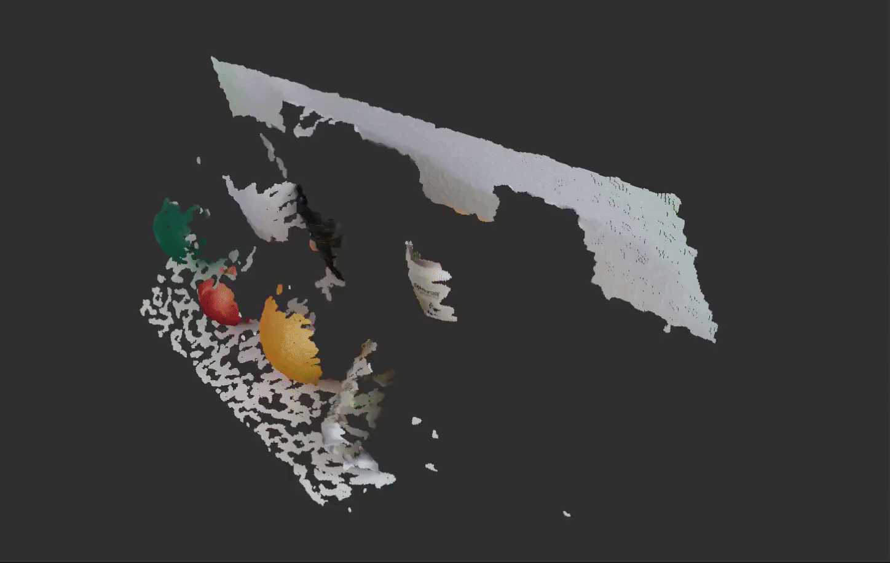

# Geometric Primitive Fitting (GPF)
 

This repository implements fitting of geometric primitives to a point cloud by the use of [Point Cloud Library (PCL)](https://pointclouds.org) modules. Planes, spheres and cylinders are currently supported.



## Dependencies

- [PCL](https://pointclouds.org/downloads/#linux)


## Building

First, clone this repository into your favourite workspace. Then build all packages with [colcon](https://colcon.readthedocs.io/en/released/user/installation.html).
```bash
mkdir -p <awesome_ws>/src && cd <awesome_ws>/src
git clone https://github.com/AndrejOrsula/gpf
cd ..
colcon build --symlink-install --cmake-args "-DCMAKE_BUILD_TYPE=Release"
```

## Usage

First, source the ROS 2 global installation (if not done before).
```bash
source /opt/ros/eloquent/setup.bash
```

Then source the ROS 2 workspace overlay (if not done before).
```bash
source <awesome_ws>/install/local_setup.bash
```

Finally, you can try it out with the following script.
```bash
ros2 launch gpf gpf.launch.py
```

## License
This project is licensed under [BSD 3-Clause License](LICENSE).
